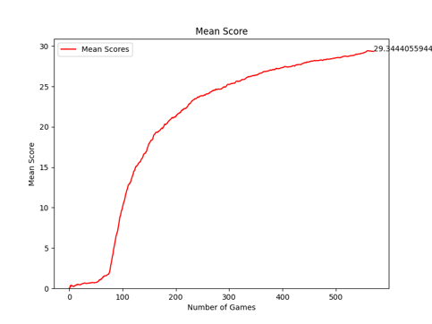
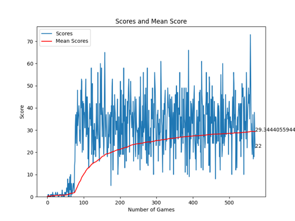

# Code
The code for the Snake Game can be found here.
There are four file types that must be loaded:
  - Agent
  - Game
  - Helper
  - Model
    
There is also an ariel font that must be in the same folder for the game display.
When running, there should be folders named 'games' and 'graph' in which every 10 games will be saved as a gif, and the final graph(s) will be saved.

The 'games' folder will give two different images such as those below:
 
The four files do as expected. The Agent is our main file and is the file that must be run. The Game is the base game of Snake, adapted for the Agent with rewards in built. The helper is for plotting graphs and storing videos. The Model contains the heart of the Agent, the Q-Algorithm and the Neural Network.

The Q-Algorithm is as follows:

  Given a predicted Q-Value based on the previous step, we calculate the next Q-values using:
  
  )
  
  Where  represents the next state. At each step, we execute the action with the highest new Q-Value. 
  The weights and biases are then according to the mean squared error loss function defined by:
  
  %5E2)
  
  Using this loss function, the neural network is updated using back propagation using gradient descent methods.

When saving all of the files in a location, the code is run by loading the terminal (I used the anaconda terminal) and ensuring all the packages are installed (NumPy, Matplotlib, Pygame and Pytorch are the main ones). A quick runthrough is:
  - Load the folder by using `cd [insert directory]`
  - Activate the pygame environment using `conda activate pygame_env`
  - Run the code by using `python agent.py`

The original article that assisted can be found [here](https://medium.com/@nancy.q.zhou/teaching-an-ai-to-play-the-snake-game-using-reinforcement-learning-6d2a6e8f3b1c) although, I believe this is based on a YouTube video that can be found [here](https://www.youtube.com/watch?v=L8ypSXwyBds&t=1010s) as credited in the initial article.

Substantial changes have been made to the code, including different files that change the output in rendering and graphs. These changes include gif and graph saving (this was a large task), rendering optionality and different structure. I have also commented on most steps in the lines of code, partly for my own understanding but also for reference when looking through the code.
