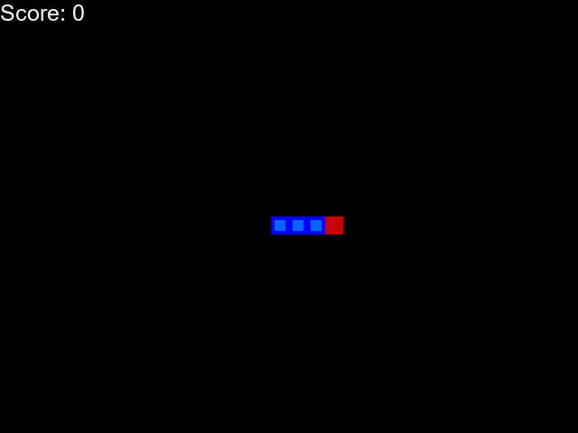

# The Mathematics of Reinforcement Learning and its Applications
## Aadam Ul Haq
---
This repository consists of my 'Maths in Action' Project, which is the 4th Year MMath Dissertation. 
The repository is split into two parts: the code and the rest of the dissertation material.
The main aspects of the Maths in Action Project are:
  - A [Scholarly Report](Dissertation/Scholarly%20Report%20(Main%20Dissertation).pdf)
  - A [Popular Science Article](Dissertation/Popular%20Science%20Article.pdf)
  - An [A1 Poster](Dissertation/Poster.pdf)
  - A [Presentation](Dissertation/Presentation%20(PDF).pdf)

The [code](Code) was done additionally in Python as supplementary material for the above. 
As the title says, the main dissertation is broken into two sections: The Mathematics of Reinforcement Learning and its Applications. In particular, we will focus on Deep Q Learning models, with a worked application of the Snake Game.

---

## Acknowledgements

I would like to thank the module organisers, Professor Charlie Elliott and Dr Ed Hill for supporting and giving guideance during the module. Additionally I would like to thank my tutor, Dr Vedran Sohinger, for offering feedback of the overall work and checking how I progressed. Moreover, I would like to thank Dr Martin Lotz and Professor Magnus Richardson for kindly meeting me during the planning phases and offering book suggestions and where to look for more information.
